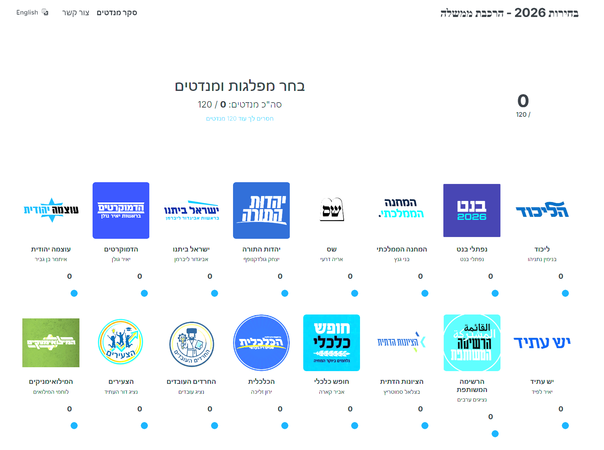

# Elections 2026

Interactive platform for building and sharing election coalitions.

## Quick Start (Docker)

You can easily start the application and automatically open the UI by running the provided script (double-click or run via terminal):
```bash
.\run-app.bat
```

Alternatively, you can manually use standard Docker commands:
```bash
docker-compose up -d --build
```
- **UI**: http://localhost:8085
- **API**: http://localhost:7265

---
© 2026 All Rights Reserved - **cpo7**
